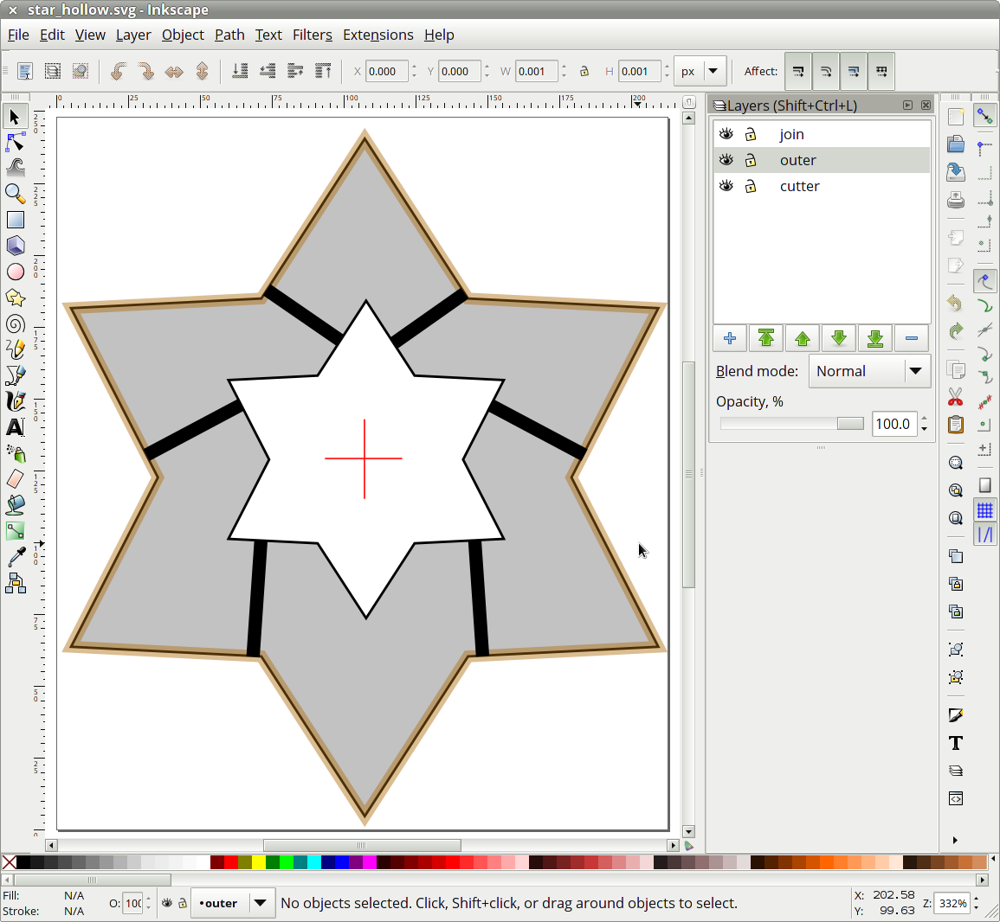
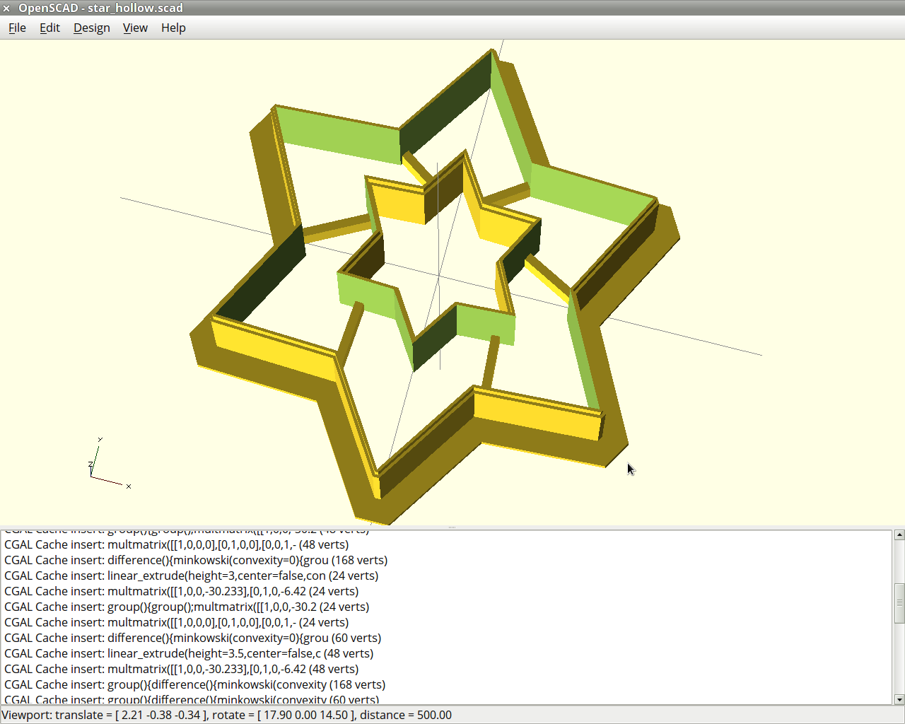
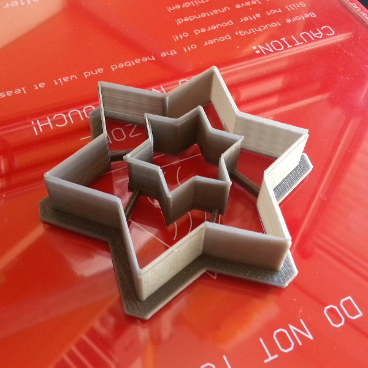

CookieCutters
=============

Cookie cutters in various shapes (+ scripts to make more), for those
of you that have a 3D printer.

1. Draw the silhouette
----------------------

Create a SVG file in Inkscape with 3 layers: "cutter" (cutting parts),
"join" (unions between parts, optionally), "outer" (outer
silhouette). Put the shapes at the bottom left of the page, which is
(0, 0) in DXF. See the SVG files for some examples.

2. Convert to DXF
-----------------

Using an extension of Inkscape called "Flatten Beziers" (Extensions >
Modify Path > Flatten Beziers...), convert all curves to
polylines. Save a copy of the file in DXF format ("Desktop Cutting
Plotter (AutoCAD DXF R14)").

3. Create an OpenSCAD file
--------------------------

The file should be something like:

    #include <cookie_cutter.scad>
    cookie_cutter("star_hollow.dxf", 15, 3.5, 0.4);
    
The module `cookie_cutter` has 4 parameters: filename (the DXF file you
exported before), height (in mm), join height (in mm), and
nozzle_width, so that you can adjust to you printer nozzle.

If you need to **join** the diferent parts of the cutter, use
`cookie_cutter_join`:

    #include <cookie_cutter.scad>
    cookie_cutter_join("star_hollow.dxf", 15, 3.5, 0.4);

The difference between the two versions is just that the version with
`join` will use the "join" layer in the DXF and the other one won't.

4. Compile and export to STL
----------------------------

Compilation might be slow, since the`cookie_cutter` module uses
`minkowski` in several places. Export to STL, and then...

5. Print
--------

Enjoy!
